# Tsuzuku

Release host for **Tsuzuku** — an Android anime app on the AniKoto source, with
the scraper embedded on the phone. No account, no tracking, and no server in
between: nothing to go down between your phone and the source.

## Direct download

| Build | Version | Released | Size | |
| --- | --- | --- | --- | --- |
| **Mobile (arm64)** — phone app (Android). Offline downloads, episodes saved to your phone with the subtitles inside, MyAnimeList and AniList sync, picture-in-picture, subtitles translated on the phone, sub and dub. | v3.2.0 | 6 Oct 2026 | ~53 MB |  |
| **Universal** — the same app for older 32-bit phones, a few releases behind. | v2.0.0 (2) | 20 Sep 2026 | ~72 MB |  |

Every build is also listed on the [**Releases**](https://github.com/Syha-01/Tsuzuku/releases) page.

### New in 3.2.0

Saved episodes play in every video player — the audio used to crackle in some
and stall others completely — and saving one puts its subtitles inside the
file. **Save all** writes every download to a folder in one go. Full notes on
the [release page](https://github.com/Syha-01/Tsuzuku/releases/tag/v3.2.0).

## Screens

  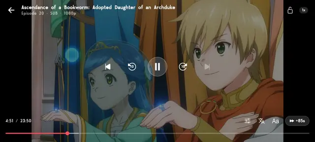

<b>The player</b> — landscape whichever way the rest of the app is set. Quality,
audio track and subtitles sit in the controls rather than behind a settings gear, beside a
<code>+85s</code> button for clearing an opening. Everything else is a gesture.

<table>
<tr>
<td align="center" width="25%">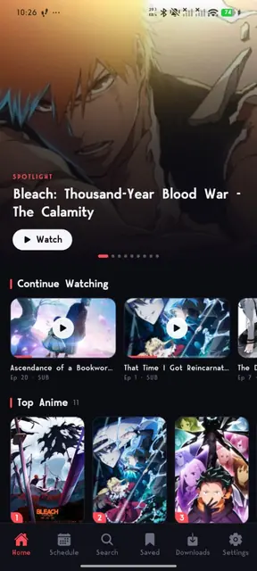 <b>Home</b> Spotlight, Continue Watching and a ranked grid</td>
<td align="center" width="25%">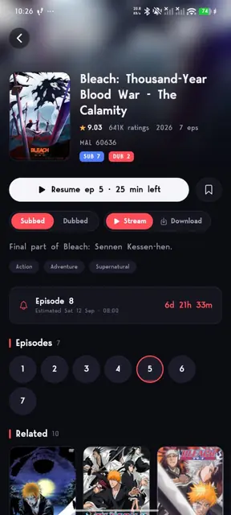 <b>Series detail</b> Rating, resume, and a countdown to the next episode</td>
<td align="center" width="25%">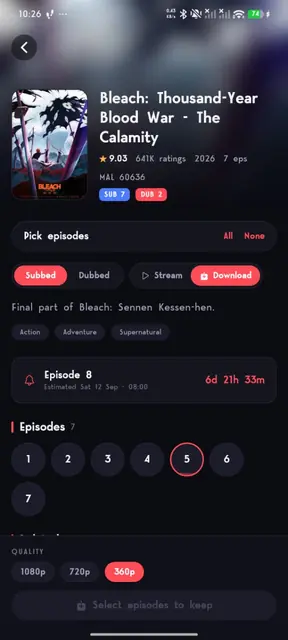 <b>Downloading</b> Pick a batch; only the sizes it comes in</td>
<td align="center" width="25%">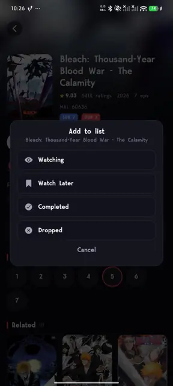 <b>Tracking</b> Watching, Later, Done or Dropped</td>
</tr>
<tr>
<td align="center" width="25%">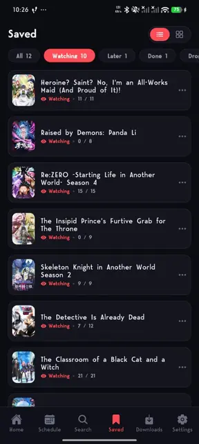 <b>Saved</b> Split by status, with progress against the episode count</td>
<td align="center" width="25%">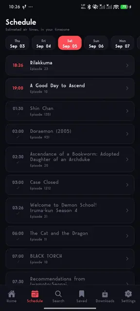 <b>Schedule</b> Estimated air times in your timezone</td>
<td align="center" width="25%">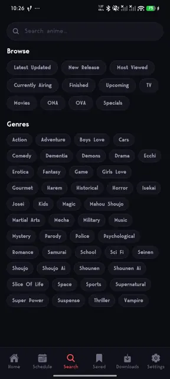 <b>Search &amp; browse</b> Eleven listings and forty-seven genres</td>
<td align="center" width="25%">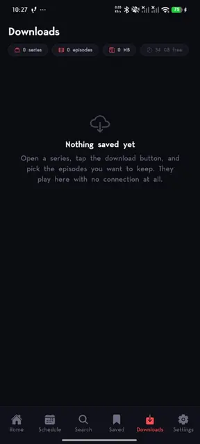 <b>Downloads</b> Saved episodes, playable with no internet</td>
</tr>
</table>

<b>Settings</b> — eight sections, each one folds open on its own

 

<table>
<tr>
<td align="center" width="25%">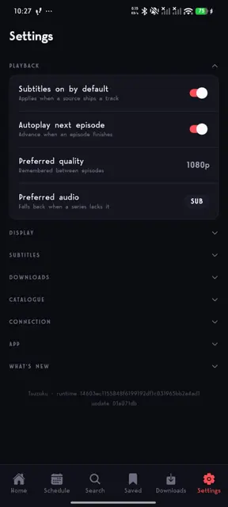 <b>Playback</b> Subtitle and autoplay defaults</td>
<td align="center" width="25%">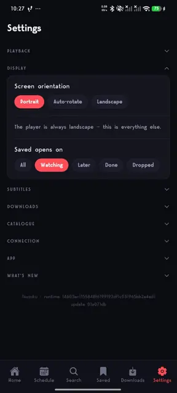 <b>Display</b> Orientation, and where Saved opens</td>
<td align="center" width="25%">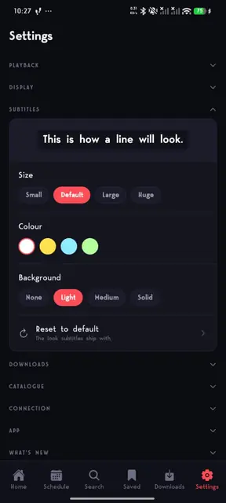 <b>Subtitles</b> Size, colour and background</td>
<td align="center" width="25%">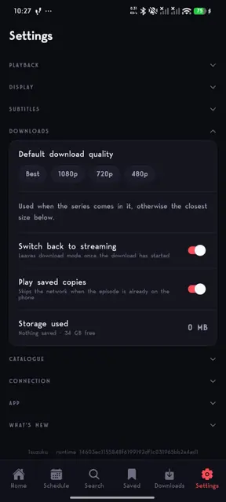 <b>Downloads</b> Default quality, segments at once, storage used</td>
</tr>
<tr>
<td align="center" width="25%">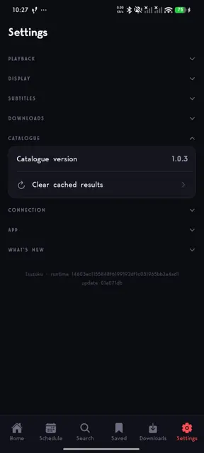 <b>Catalogue</b> Scraper version, and clearing its cache</td>
<td align="center" width="25%">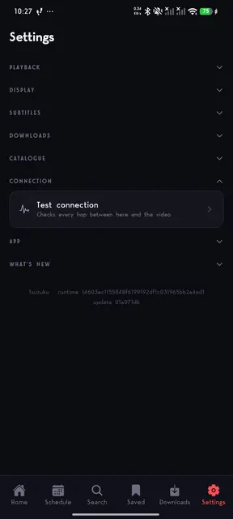 <b>Connection</b> Names the first step of the chain that fails</td>
<td align="center" width="25%">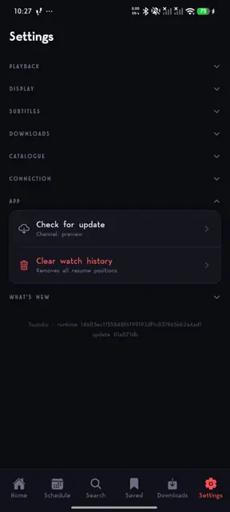 <b>App</b> Over-the-air updates, clearing history</td>
<td align="center" width="25%">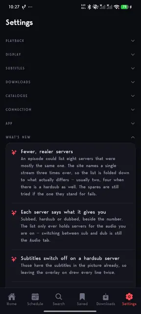 <b>What's new</b> Release notes, newest first</td>
</tr>
</table>

## What it does

- **Episodes saved to the phone** — pick a batch, or hold one episode to grab just that one. They play with no connection at all, subtitles included, and the progress counts the same as if you had streamed it. Downloads keep running in the background and pick up where they stopped if the app is killed.
- **Subtitles translated on the phone** — pick Spanish or Japanese in the player's subtitle menu and the track is translated on the device itself. The language pack comes down once, after which it needs no connection. An episode can be saved with the translated track baked in, so it reads the same offline.
- **Episodes written out to a folder** — saved episodes go to Downloads, an SD card or anywhere else on the phone, one at a time or all at once, with the subtitles inside the video (MKV) so they show in any player, on the phone or a computer.
- **Quality switching that keeps playing** — pick a rendition mid-episode and the picture changes while the timeline doesn't. The choice is remembered across episodes.
- **Sub and dub as separate lists**, switchable mid-watch.
- **Subtitles rendered by the app** — size, colour and background are yours to set, and cues that drift against the video are pulled back into line.
- **Player gestures** — double tap either side to seek and repeat taps stack into one jump, hold anywhere for 2×, drag on the left for brightness and on the right for volume. `+85s` clears a cold open plus the OP in one press.
- **MyAnimeList and AniList** — sign in to bring your list with you and keep what you watch in step with it.
- **Picture-in-picture** — go home mid-episode and it keeps playing in a corner, subtitles included.
- **Continue watching, a saved list with progress, genre browsing and the airing schedule.**
- **Updates over the air** — fixes arrive on their own; Settings → *Check for update* pulls one on demand.

## Which device

The main APK is built for 64-bit ARM phones — virtually every Android phone
from 2016 onward. Older 32-bit phones take the universal build, which stays on
2.0.0 for now. Intel-based devices and Android Studio emulators are not
covered.

> Sideloaded APKs: when installing, allow "Install unknown apps" for your
> browser or file manager. Android's "this file may harm your device" prompt is
> normal for any APK downloaded outside the Play Store.

### App won't load, or "can't reach the source"?

Some networks and internet providers block streaming content. If the app can't
reach the source on your connection, a VPN usually settles it.

## For developers

**[MegaPlay stopped returning a stream](megaplay-fix.md)** — September 2026.
`/stream/getSources` swapped the stream URL for an encrypted blob, so anything
reading `sources.file` got nothing and reported it as a missing server. The fix
is an endpoint, not a cipher: MegaPlay's own player had already moved to
`/stream/getSourcesNew`, which still answers in plaintext.

Written up for anyone else scraping AniKoto or MegaPlay — what broke, why it
only appeared to affect some episodes, the drop-in replacement for
`getSources`, and the CDN host that 403s video while still serving subtitles.
There is [an offline copy](megaplay-fix.html) too.
